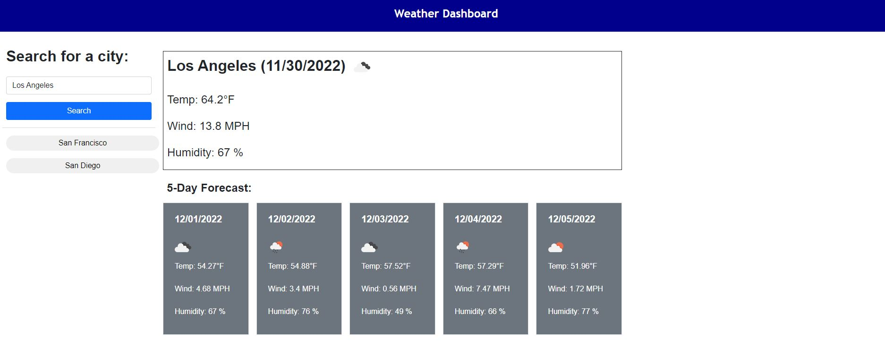

# Weather-Dashboard
Repository for Module 6 challenge - a weather dashboard that will run in the browser and feature dynamically updated HTML and CSS.  It will display current weather  for a city along with 5 day forecast.

## Description
Weather dashboard displays the current weather and a 5-day forecast of the city the user inputs.  It also keeps track of the search history which the user have access to. Here are the features of this program:

1. At the start of the application
    * The search page is defaulted to San Francisco
    * The current weather is displayed of the day with today's date,  a weather icon representing the condition, temperatre, wind velocity and humidity percentage.  
    * Below it, there is a five day forecast of the same city with date, temperature, wind velocity and humidity percentage.
    * If the local storage is not empty, the last searched city will be displayed in City name and it's current and forecast weather will be displayed.
2. When the user enters a new city and clicks the Search button:
    * The older city is displayed as clickable history under the form on the sidebar.
    * The new city is added to the local storage.     
    * The current weather and 5 day forecast is displayed on right side.
3. When the user clicks on a city in the search history then they are presented with current and future conditions for that city.

![Note:]There is a known issue in the application.  Sometime the day and night weather condition icons are different between current and forecasted weather.  For example,  you will see that if a user on west coast search for east coast city, depending on the time of the day, the current weather will show current weather of east coast but the forecast will be of the time slot of the user.  So if it night on east coast, the current weather icon will be for night but as it is still day on west coast the forecast icons will be day time ones.  It can be solved given time but at this time it is out of scope.

## Mock Up

Demo of the project:

## Usage
You can access:
1. the file in GitHub repository: https://github.com/rbhumbla1/Weather-Dashboard
2. the application using this URL: https://rbhumbla1.github.io/Weather-Dashboard

## License
None
